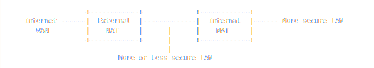

# Secured NAT Router

| Threat	           | Solution                       |
|-------------------|--------------------------------|
| Default exploits	 | Flash OpenWRT/pfSense          |
| Weak firewall	    | Default-deny + IP whitelisting |
| Brute-force SSH	  | Key auth + fail2ban            |
| Remote attacks	   | VPN-only access                |
| ARP spoofing	     | DAI (if managed switch)        |

```{contents} Table of Contents
:depth: 3
```

A second NAT router can be used on the internal LAN to create a second, more secure LAN.



## Benefits

* Machines on the more-or-less-secure internal LAN can access the internet, but they are protected by the External NAT from most malwares.
* Machines on the more-secure internal LAN can also access the internet, first by going out through the Internal NAT and then the External NAT. 
* Because the more-or-less-secure internal LAN is on the WAN side of the Internal NAT, machines on the more-or-less-secure internal LAN are unable to freely access the machines on the more-secure LAN behind the Internal NAT. Machines behind the Internal NAT can access the machines in the middle, but NOT the other way around.

## When and where is this useful?

* For isolating a router's Demilitarised Zone (DMZ) network and servers.
* Isolating an open or low-security wireless access point.
* Protecting one ''high-value'' machine from the rest of the network.

## Flash custom firmware (Replace stock OS)

Stock router firmware often has unpatched vulnerabilities. Replace it with a security-focused OS:

Recommended Firmware Options:

| Firmware	 | Best For	               | Key Features                               | 
|-----------|-------------------------|--------------------------------------------|
| OpenWRT	  | Most routers	           | Firewall, VPN, IDS, QoS                    |
| DD-WRT	   | Broadcom-based routers	 | VLANs, VPN, advanced NAT                   |
| pfSense   | (x86 routers)	          | High security	Enterprise firewall, IDS/IPS |
| OPNsense	 | User-friendly	          | Modern UI, Zenarmor (NGFW)                 |

Installation Steps

* Check compatibility on the firmware’s website (e.g., [OpenWRT Table of Hardware](https://openwrt.org/toh/start)).
* Backup stock firmware (in case of rollback).
* Flash via TFTP/recovery mode (varies by router).
* Reset to defaults after flashing.

## Harden the firewall

### Default-Deny policy

Block all inbound traffic (only allow replies to outbound requests):

```
# OpenWRT (via `uci`)
uci set firewall.@defaults[0].input="REJECT"
uci set firewall.@defaults[0].output="ACCEPT"
uci set firewall.@defaults[0].forward="REJECT"
uci commit && service firewall restart
```

### Restrict LAN → Router access

Allow only admin IPs to access the router’s admin panel:

```
# OpenWRT example (allow only 192.168.1.100)
uci add firewall rule
uci set firewall.@rule[-1].src='lan'
uci set firewall.@rule[-1].dest_port='80,443,22'
uci set firewall.@rule[-1].proto='tcp'
uci set firewall.@rule[-1].target='ACCEPT'
uci set firewall.@rule[-1].src_ip='192.168.1.100'
uci commit && service firewall restart
```

### Block WAN ping & scans

Disable ICMP (ping) and stealth-mode the router:

```
uci set firewall.@rule[0].enabled="0"  # Disable ping
uci commit && service firewall restart
```

## Secure Router access

### Change default credentials

* Set a strong password (use pwgen 16 1 for a random one).
* Disable default admin accounts (e.g., admin:admin).

### Enable SSH (With Key Auth)

Generate SSH keys on PC:

```
ssh-keygen -t ed25519 -f ~/.ssh/router_key
```

Copy the public key to the router:

```
ssh-copy-id -i ~/.ssh/router_key.pub root@192.168.1.1
```

Disable password login:

```
uci set dropbear.@dropbear[0].PasswordAuth="off"
uci commit && service dropbear restart
```

### Restrict Web Admin access

Allow only via LAN/VPN (disable WAN access):

```
uci set uhttpd.main.listen_http="192.168.1.1:80"
uci set uhttpd.main.listen_https="192.168.1.1:443"
uci commit && service uhttpd restart
```

## Enable VPN-Only remote access

Instead of exposing the router to the internet, require VPN access:

### Set Up WireGuard (OpenWRT)

Install WireGuard:

```
opkg install wireguard-tools
```

Generate keys:

```
wg genkey | tee privatekey | wg pubkey > publickey
```

Configure `/etc/config/network`:

```
config interface 'wg0'
  option proto 'wireguard'
  option private_key '<PRIVATE_KEY>'
  list addresses '10.0.0.1/24'
config wireguard_wg0
  option public_key '<CLIENT_PUBKEY>'
  option allowed_ips '10.0.0.2/32'
```

### Block All WAN admin access

Ensure no ports (22, 80, 443) are forwarded to the router.

## Monitor & log attacks

### Enable logging

Log firewall drops (OpenWRT):

```
uci set firewall.@defaults[0].log="1"
uci commit && service firewall restart
```

View logs:

```
logread -f | grep firewall
```

### Intrusion Detection (Snort/Suricata)

Install on OpenWRT/pfSense:

```
opkg install suricata
suricata -c /etc/suricata/suricata.yaml -i br-lan
```

## Physical security

* Disable unused ports (USB, Telnet, FTP).
* Place in a locked cabinet (prevents tampering).
