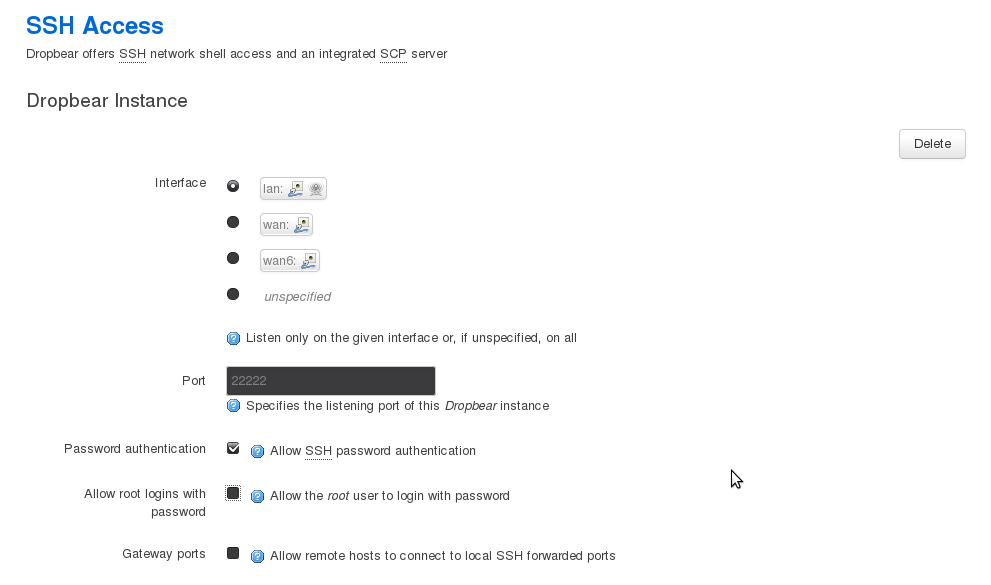

# DropBear SSH public key authentication

If you do not have a public key yet, create one.
    
    $ ssh-keygen -t dsa    

Followed by a fingerprint and random art image of the key.

Copy the public key with `scp` to OpenWrt: 

    $ scp ~/.ssh/id_dsa.pub root@192.168.1.1:/tmp    

`ssh` to the router (requires a password, as the key has not been added to authorized_keys yet).

    $ ssh root@192.168.1.1    

 

Add the key to `authorized_keys`. If not exists, it will be created. Adjust its permissions. 

    # cd /etc/dropbear
    # cat /tmp/id_*.pub >> authorized_keys
    # chmod 0600 authorized_keys    

 

Now ssh works from a local machine to the router, and no password is sent in the clear or encrypted, instead you'll be asked for the passphrase you entered when you created the key in the first step. You can repeat this from each machine that you wish to be able to access the router, and add the keys as above. 

## Running SSH on another port

That of course changes how you `ssh` to the router:

    $ ssh root@192.168.1.1 -p 22222    

## Whitelisting IP's

Allow SSH only from trusted (whitelisted) IP's, and drop any other request to `port 22`. If doing that from a Local Area Network (LAN) you will need to set a static DHCP address first. dnsmasq is default running on OpenWrt; it allocates IP addresses in the range of 192.168.1.100 to .250 on the internal interface to connected hosts. Pick an IP address outside these, like `192.168.1.251`

Create a `/etc/lists/whitelist.conf` with in it:

    192.168.1.251                        ## A trusted IP
    192.168.1.252                        ## Another trusted IP    

And open up `/etc/firewall.user` and add:

    WHITELIST=$(sed 's/#.*//' /etc/lists/whitelist.conf)

    for IP in ${WHITELIST}; do
        iptables -t nat -A prerouting_rule -i $WAN -s $IP -p tcp --dport 22 -j ACCEPT
        iptables        -A input_rule      -i $WAN -s $IP -p tcp --dport 22 -j ACCEPT    

Done.
